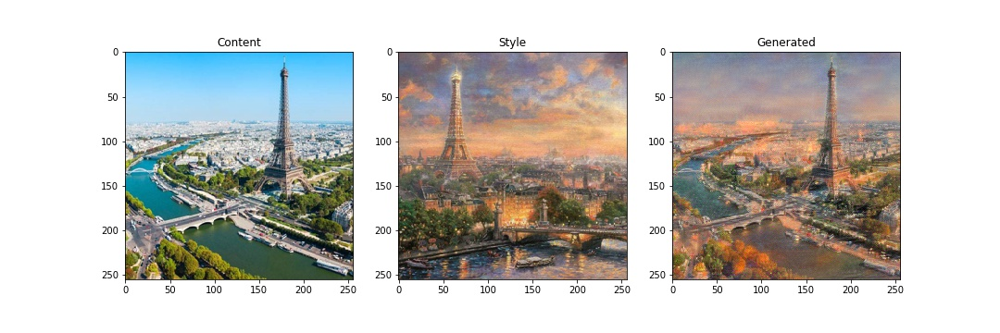

# StyleTransfer
Pytorch implementation of style transfer technique proposed by [Gatys et al, 2016](https://arxiv.org/abs/1508.06576).


### Requirements
* torch
* torchvision
* PIL

### Usage
```
python style_transfer.py --content-path [path to content image] --style-path [path to style image]
```
Run `python style_transfer.py -h` for list of optional arguments.

Example usage
```
python style_transfer.py --content-path ./examples/obama.jpg --style-path ./examples/van-gogh.jpg --output "./examples/obama X van-gogh/" --use-gpu --num-steps 200
```

Check out [Jupyter notebook](<./Style Transfer.ipynb>) for description of the style transfer technique.

### Examples
Some cool examples generated by the model:

IIT Delhi campus stylized as Van Gogh's The Starry Night.


City of Paris regenerated with inspiration from a painting of the city


Professor from Money Heist inspired by Dali.

